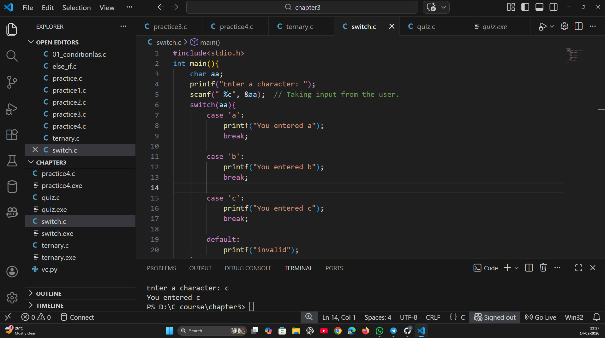

# C Programming Basics

This repository contains my C programming practice.
I am learning C to build strong foundations for systems,
networking, and cybersecurity.

Status: Day 1 – Getting started

Status: Day 2: Variables, constants, arithmetic, relational and logical operators

Status: Day 3: Conditionals
C basics covering:
- if statement
- if-else statement
- else-if ladder
- ternary operator
- switch-case

### Chapter 3: Practice Screenshot
Here is a screenshot of my VS Code while practicing Chapter 3:

Status: Day 4 - Loop Control Instructions
Topics Covered:
- while loop
- do-while loop
- for loop
- break statement
- continue statement

Description:
This program demonstrates different loop control instructions in C.
It shows how loops execute and how break and continue alter flow control.
